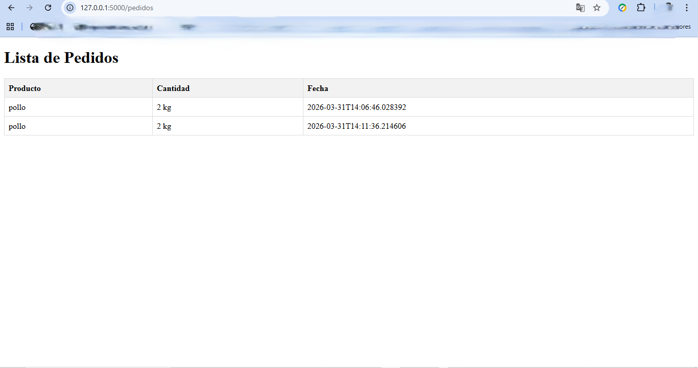

# WhatsApp Orders System
# Sistema de Pedidos por WhatsApp (Simulado)

Proyecto backend desarrollado con Flask que permite:

- Simular recepción de mensajes tipo WhatsApp
- Procesar pedidos
- Guardar pedidos en JSON
- Visualizar pedidos en una interfaz web

## Tecnologías
- Python
- Flask

## Funcionalidades
- Endpoint /mensaje
- Guardado de pedidos
- Vista /pedidos

## Objetivo
Proyecto práctico orientado a automatización de pedidos para pequeños negocios.


## Estructura de Carpetas

### 📁 `routes/`
**Propósito**: Define todas las rutas (endpoints) de la API
- `__init__.py`: Inicializa y registra los blueprints
- `orders.py`: Rutas relacionadas con pedidos

### 📁 `services/`
**Propósito**: Contiene la lógica de negocio (business logic)
- `order_service.py`: Métodos para gestionar pedidos (crear, obtener, actualizar, eliminar)
- Separa la lógica de negocios de las rutas para mejor mantenimiento

### 📁 `data/`
**Propósito**: Almacena los datos (actualmente JSON)
- `orders.json`: Almacena los pedidos en formato JSON
- Fácil migración a base de datos en el futuro

### 📁 `templates/`
**Propósito**: Archivos HTML para renderizar en el navegador
- `base.html`: Template base para todas las páginas
- Futuras páginas: index.html, orders.html, etc.

### 📁 `static/`
**Propósito**: Archivos estáticos (CSS, JavaScript, imágenes)
- Organizar estilos y scripts del cliente

## Cómo ejecutar

```bash
python app.py
```
## Vista del sistema


## Estructura escalable
Esta estructura permite:
- ✅ Separación de responsabilidades
- ✅ Fácil agregar nuevas rutas
- ✅ Código más limpio y mantenible
- ✅ Migración a base de datos sin cambios mayores
- ✅ Facilita testing
